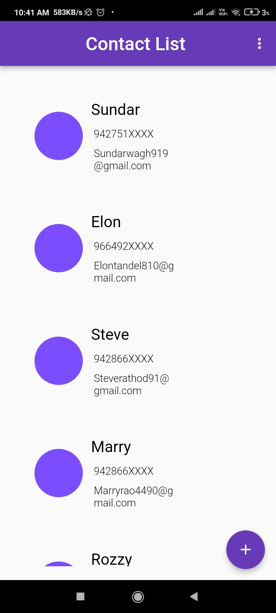
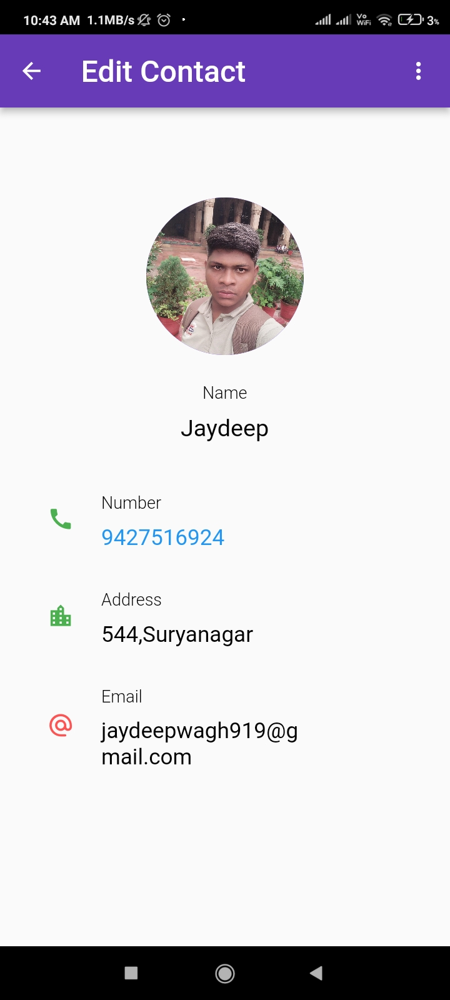
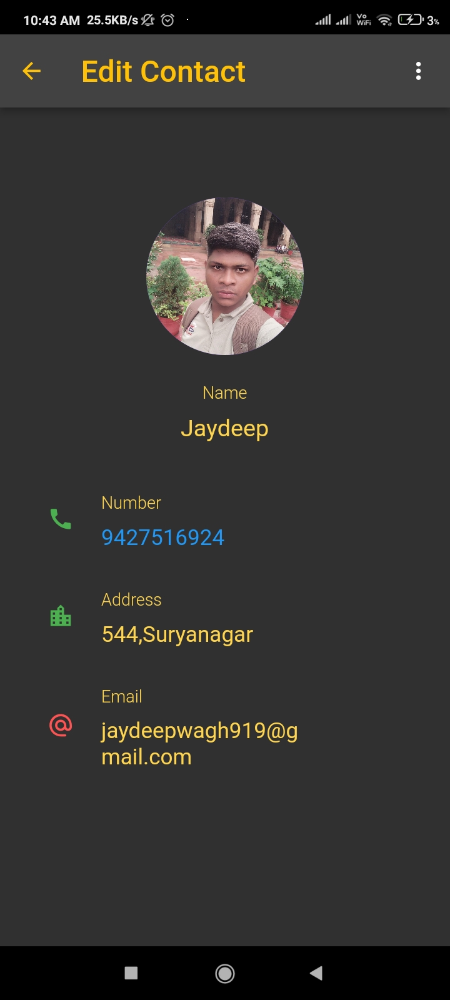
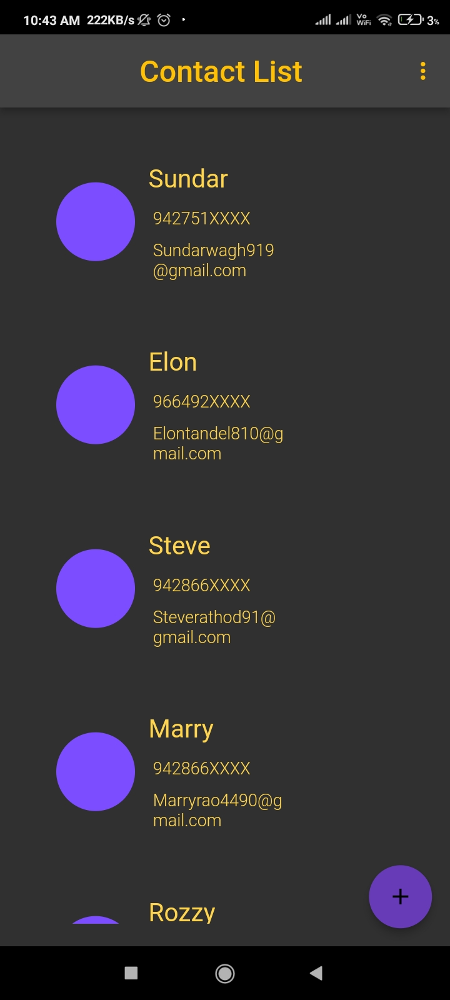

# Contact app

A new Flutter project.

## Getting Started

This project is a starting point for a Flutter application.

## What you’ll learn in part 1

How to write a Flutter app that looks natural on iOS, Android, desktop (Windows, for example), and
the web

1. Basic structure of a Flutter app

2. Finding and using packages to extend functionality

3. Using ListView.builder creates a scrollable, linear array of widgets.

4. How to implement flutter_share for providing a simple way to share a message, link or local
   files.

5. url_launcher for launching a URL. Supports web, phone, SMS, and email schemes.

How to create an infinite, lazily loaded list

 


To Impliment Dark Mode You Have To Use Themedata Class :

### What is ThemeData flutter?

=> ThemeData class Null safety. Defines the configuration of the overall visual Theme for a
MaterialApp or a widget subtree within the app. The MaterialApp theme property can be used to
configure the appearance of the entire app.

## Night Mode

 

```yaml
dependencies:
  flutter:
    sdk: flutter


  # The following adds the Cupertino Icons font to your application.
  # Use with the CupertinoIcons class for iOS style icons.
  cupertino_icons: ^1.0.2
  image_picker: ^0.8.5+3
  flutter_phone_direct_caller: ^2.1.1
  dropdown_button2: ^1.6.2
  flutter_share: ^2.0.0
  file_picker: ^4.6.1
  share_plus: ^4.0.9
  flutter_contacts: ^1.1.5
  contacts_service: ^0.6.3
  shared_preferences: ^2.0.15

```

For help getting started with Flutter development, view the

- [flutter_share 2.0.0 ](https://pub.dev/packages/flutter_share)
- [url_launcher 6.1.4](https://pub.dev/packages/url_launcher)
  [online documentation](https://docs.flutter.dev/), which offers tutorials, samples, guidance on
  mobile development, and a full API reference.
